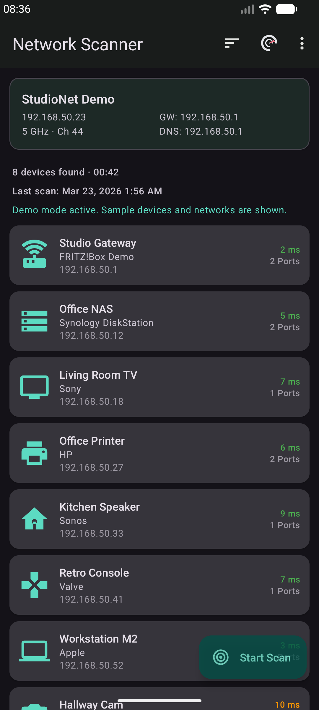
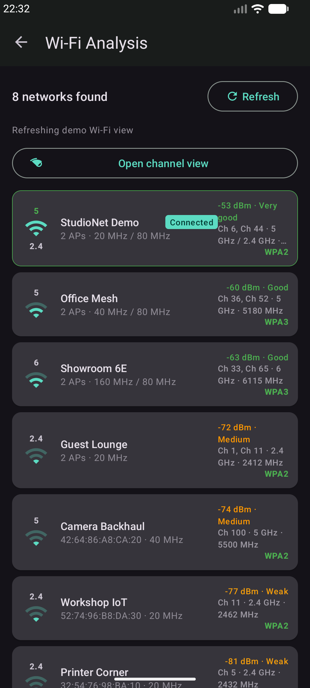
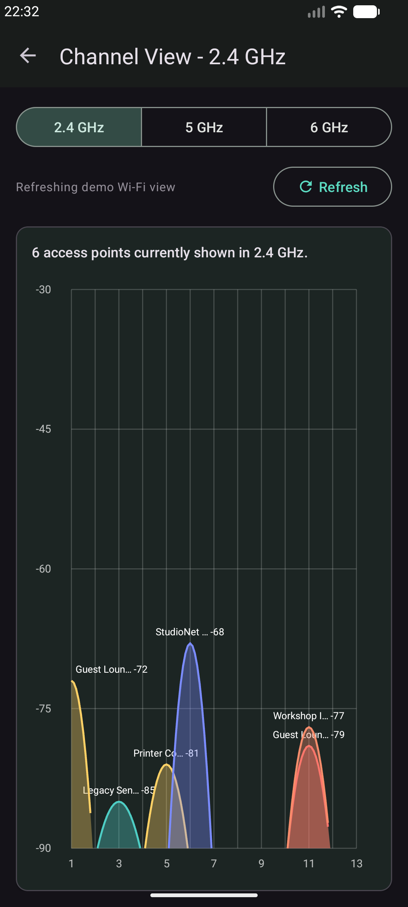
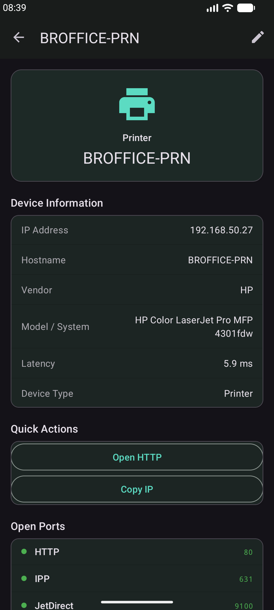

# Network Scanner

Network Scanner is an Android app for discovering devices on your local network, checking common services, and analyzing nearby Wi-Fi networks.

This repository is used only for public app downloads, screenshots, release notes, and legal files.
It does not contain the private Android application source code.

Also available in German and Spanish in the app UI.

## Download

Download the latest APK from the [Releases](../../releases) section.

Current version:
- `NetworkScanner-v0.3f.apk`

Note:
- GitHub automatically shows `Source code (zip)` and `Source code (tar.gz)` for each release tag.
- In this repository, those archives contain only the public release files from this repo, not the private app source code.

## Screenshots

  
  
  
  

## Features

- Scan devices in your local network
- Detect common services and open ports
- Group and filter devices by type
- Save custom device names and notes
- Export results as JSON, CSV, or text report
- Analyze nearby Wi-Fi networks
- View channel usage for 2.4 GHz, 5 GHz, and 6 GHz
- See signal quality, stability, and trend information
- Use a built-in demo mode for screenshots and presentations

## Installation

1. Open the [Releases](../../releases) page.
2. Download the latest APK.
3. Open the APK on your Android device.
4. If Android asks, allow installation from unknown sources for your browser or file manager.
5. Install the app.

## Notes

- The app is intended for use on your own network or on networks where you have permission to scan devices.
- Some Wi-Fi and network details require Android location permission due to platform restrictions.
- Release APKs are signed.

## Responsible use

Use this app only on networks and devices you own or are authorized to inspect.

## Support

If you enjoy the app and want to support further development:

[Buy me a coffee](https://buymeacoffee.com/wib100)

## Changelog

See [CHANGELOG.md](CHANGELOG.md)

## Legal

- [LICENSE.txt](LICENSE.txt)
- [THIRD_PARTY_NOTICES.txt](THIRD_PARTY_NOTICES.txt)
